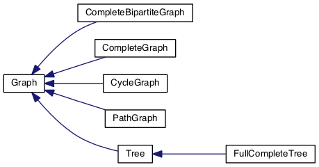

# Graphs

This repository contains an extensible collection of graphs and graphing algorithms written in C++. 

## Setup

Just run `make` to build the executable. If you want to visualize the graphs, you'll need to have graphviz's `dot` utility installed.

Feel free to run `doxygen Doxyfile` to generate HTML / Latex documentation in the `docs/` folder. 
- *Note: I've enabled `HAVE_DOT`, so make sure to have that installed if you want Doxygen to run as is.*

## Usage

The principle executable lives in `bin/graph`. Currently there are three options, as documented below: `generate`, `analyze` and `search`. All three commands output the graph in appropriate `dot` format for visualization. Both `analyze` and `search` takes graphs (in `dot` format) from `stdin` and then process them. This allows for pipelines, as shown in the examples.

### generate

Generate a specific type of graph.

```
graph generate TYPE [-n SIZE] [-m SIZE] [-c CHILDREN] [-t <directed|undirected>]
```

- currently valid options for `TYPE` are:
	- `cycle`: generates a Cycle
	- `path`: generates a Path
	- `complete`: generates a Complete Graph
	- `tree`: generates a full and complete tree
	- `bipartite`: generates a Complete Bipartite Graph
- `[-n SIZE]`: size of the graph. 
	- For cycles, paths and complete graphs, this is the number of vertices. 
	- For trees, this is the height of the tree.
	- For bipartite graphs, this is the number of vertices in one section. The number of vertices in the other section is given by the `-m SIZE` option.
- `[-m SIZE]`: see above. Specifies the number of vertices of the second piece of a bipartite graph.
- `[-c CHILDREN]`: number of children of each node in a tree.
- `[-t <directed|undirected>]`: the type of the graph (undirected or directed). This argument is ignored for trees.

### analyze

Analyze a graph.

```
graph analyze [-p PROPERTY]*
```

- `[-p PROPERTY]`: property to analyze. Currently valid options are:
	- `connected`: determine whether the graph is connected
	- `cycle`: determine whether the graph contains a cycle
	- `tree`: determine whether the graph is a tree

### search

Search from one node to another in a graph.

```
graph search FROM TO [-t <breadth|depth>]
```

- `FROM`: starting vertex label in the search
- `TO`: vertex to search for
- `[-t <breadth|depth>]`: the type of search to perform

## Examples

On a Mac, try some of the following:

```bash
# generates a ternary tree of height 3 and displays it using dot and preview.
$ graph tree -n 3 -c 3 | dot -Tpng | open -a Preview.app -f

# generates the complete bipartite graph K (3,4)
$ graph bipartite -n 3 -m 4 | dot -Tpng | open -a Preview.app -f

# test the properties of a tree
$ graph tree -n 3 -c 3 | graph analyze -p connected -p cycle -p tree

# depth-first search from vertex 2 to 4 in a complete graph of size 5
$ graph complete -n 5 | graph search 2 4 -t depth
```

## Structure

Here's a visualization of the class hierarchy, as generated by Doxygen / Dot:



A `Graph` is a collection of `vertices` (of type `Node`) and `edges` (of type `Edge`). There are various subclasses of graphs, including those shown above. Notably, a `Tree` is also a `Graph` :). For more information, see the generated documentation.
